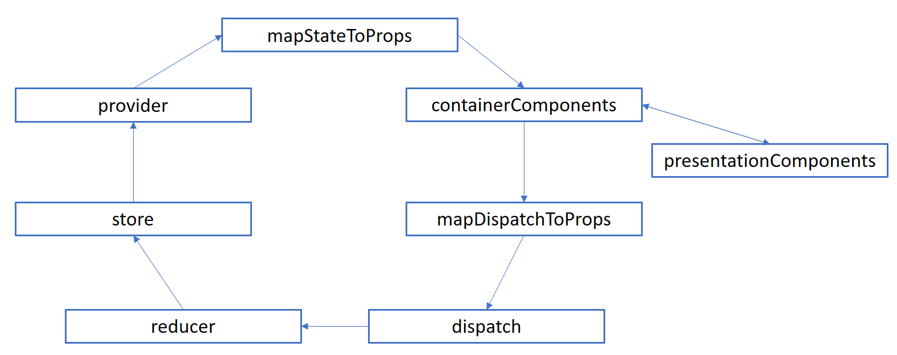
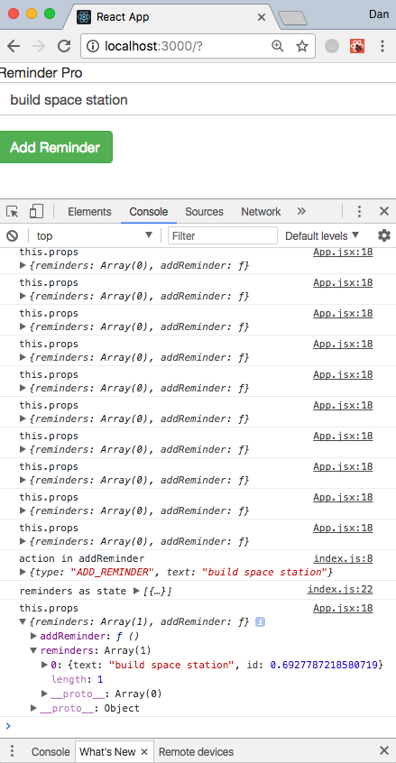

This app is based upon the Udemy tutorial found [here](https://www.udemy.com/react-js-and-redux-mastering-web-apps/learn/v4/t/lecture/6379046?start=0) although I have expanded upon many of the explanations.

My GitHub repository is located [here](https://github.com/danhagg/reminder).

This is a simple Reminder app that can take in a task and due date. The app stores reminders and reminders can also be deleted.

Let's make a `reminder` folder locally then create a `reminder-app` within this folder using the `create-react-app` function from the command line and then change directory into our app.

```
mkdir reminder
create-react-app reminder-app
cd reminder-app
```

Now install the redux and react-redux libraries for future use.

```
npm install redux react-redux --save
```

Now we can start the default React app that has just been installed and view it on `localhost:3000` with the command...

```
npm start
```

And we see this!


Paste minified css file from Bootstrap so we can start using the `css` classes from the get-go. We add the stylesheet reference to our `index.html` file located in the `public` folder. We then delete clean out the entire `src` folder of our app as we will start building reminder-app from scratch.

In our empty `src` folder we can now start adding files and code. First up, we add an `index.js` file with the following...

```js
import React from 'react';
import ReactDOM from 'react-dom';
import App from './components/App'

ReactDOM.render(
  <App />, document.getElementById('root')
);
```

In `src` make a `Components` folder for all our `Components` as we make them, starting with base of our app with a form for user to input a reminder and a submit button in `App.jsx`...
```js
import React, { Component } from 'react';

// the classNames are titled to utilize css from bootstrap
class App extends Component {
  render () {
    return (
      <div className='App'>
        <div className='title'>
        Reminder Pro
        </div>
        <div className='form-inline'>
          <div className='form-group'>
            <input className='form-control' placeholder='I have to...' />
          </div>
          <button type='button' className='btn btn-success'>Add Reminder</button>
        </div>
      </div>
    );
  }
}

export default App;
```

Our `localhost:3000` now looks like this!


### Adding functionality to the Add Reminder feature!
First we need to set up redux. There is some setup time to Redux but it simplifies the app once the app gets large and starts to deal with lots of data. Redux works by creating a single global `store object` for the entire application `state`. Instead of multiple stores or states you simply have multiple properties on that one big `JavaScript object`. The `store's state` can be changed by `dispatch actions`. Adding a reminder will make an addition to the `store`, thereby necessitating a `state` change of the `store`. This is carried out by the creation of an entirely new `store object`. The original `store object` is never mutated it is simply replaced and, in this manner, we can keep an entire history of the `store`.
Redux actions are plain `JavaScript objects` and follow standard JavaScript rules...

```js
{
  type: 'ADD_REMINDER',
  payload: 'data'
}
```
The `type` property tells Redux what kind of action is being performed.
The `payload` key may hold data or other `key` that contains necessary info to help action update the `store`.

The `JavaScript object` is made through an `action creator` which returns the `JavaScript action` itself.

Thus, the `action` is a `JS object` itself and the `action creator` is the `function` that `returns` that `action` in the following fashion...

```js
function () {
  {
    type: 'ADD_REMINDER',
    payload: 'data'
  }
}
```

So, in the case of our own app, what is going on? Take a look at the following diagram.


Firstly, in our app, the user would interact with the `UI` and submit a reminder. This triggers the `action creator function` which produces a `dispatch action object` which leads to an update of the `store's state` via some `reducers`. Instead of multiple `stores` we have multiple `reducers` that modify a piece of data from the store in an immutable way. The new current `state` of the `store` is then passed back to the `UI`. If our app has multiple `Components`, all these individual `Components` are wrapped by a single `Provider Component` that interacts with the store and when the `store` changes the `Provider Component` re-renders the entire application via the `virtual DOM`. It is the individual `Components` that also produce the `dispatch actions` that feed into the `reducers`. Thus, we have our complete redux data flow.

Back to our app. We need a file to hold the types of our object. These types will be defined as `constants`. They are often defined in a series of files in a `constants` folder but we can make do with just one `constants.js` file in our `src` folder.

`constants.js`
```js
// the value associated to ADD_REMINDER variable can be pretty much anything, it doesn't matter
export const ADD_REMINDER = 'ADD_REMINDER';
```

Now let's add a folder to `src` that contains all our actions, called, um... `actions` which will hold our `index.js` file.

`actions/index.js` is our `action creator`.
```js
// backup one directory from actions
import { ADD_REMINDER } from '../constants';

// call function addReminder and declare it as a constant, takes in the text
// the data text could be written as 'text: text' but we can shorten this in ES6 shorthand syntax when key and value are simply same.
// Shortened to simply 'text'
export const addReminder = (text) => {
  const action = {
    type: ADD_REMINDER,
    text: text
  };
  console.log('action in addReminder', action);
  return action;
};
```

### Initializing the application store
Create the `Provider Component` from React-Redux that will pass down it's `store` to our app.

So, back in our root `index.js` we import and create the `Provider Component` that takes in (wraps) the `App Component` (and all other `Components` that will subsequently feed into `App.jsx`).

We also need to import and create a `store` from `redux`.
```js
import React from 'react';
import ReactDOM from 'react-dom';
import App from './Components/App';

// import to make Provider and Store
import { Provider } from 'react-redux';
import { createStore } from 'redux';

// import to take in reducer (described in next snippet)
import reducer from './reducers';


const store = createStore(reducer);

ReactDOM.render(
  <Provider store={store}>
    <App />
  </Provider>,
  document.getElementById('root')
);
```

The next bit of boilerplate involves creating our first `reducer` in a new `index.js` file in a folder, called... yes, `reducers`.

```js
import { ADD_REMINDER } from '../constants';

// our reminder action is defined first
const reminder = (action) => {
  return {
    text: action.text,
    id: Math.random()
  };
};

// Our first reducer as a constant = an anonymous arrow function
// Later null can be changed to return a state
// Remember our action returns a type. We can use that type to modify our reminder or state.
// Use a switch statement on the action type as we can expect more than one type of action in the future alongside addReminder().
// Include an ES6 spread operator '...' which allows us to copy the contents of one array or object into another array or object
// The second element in reminders is a new reminder with the action
// we can console.log reminders for debugging and we need to return reminders
const reminders = (state = [], action) => {
  let reminders = null;
  switch (action.type) {
    case ADD_REMINDER:
      reminders = [...state, reminder(action)];
      console.log('reminders as state', reminders);
      return reminders;
    default:
      return state;
  }
};

export default reminders;
```

We need to hook up the action creator to our application. We need to modify the code of our input field and button in `App.jsx` by adding state to the Component so that our program can recognize the user text input. We need also need to add a constructor to our Component. As the [React docs state](https://reactjs.org/docs/react-component.html#constructor) "The constructor is the right place to initialize state. To do so, just assign an object to this.state; don’t try to call setState() from the constructor."

```js
import React, { Component } from 'react';

// Add the constructor and initialize the state
class App extends Component {
  constructor (props) {
    super(props);
    this.state = {
      text: ''
    };
  }

  // addReminder function to show the ouitpit of our new state
  addReminder () {
    console.log('this.state', this.state);
  }

// add onChange function to input that sets text to event value
// add addReminder function that saves state
// attach addReminder to button onClick
  render () {
    return (
      <div className='App'>
        <div className='title'>
        Reminder Pro
        </div>
        <div className='form-inline'>
          <div className='form-group'>
            <input className='form-control' placeholder='I have to...'
              onChange={event => this.setState({text: event.target.value})}
            />
          </div>
          <button type='button' className='btn btn-success'
            onClick={() => this.addReminder()}>
          Add Reminder
          </button>
        </div>
      </div>
    );
  }
}

export default App;
```
Now, in our browser, we can add a reminder and see it is console logged upon the `Add Reminder` button click.


Next, we need to connect our `Component` to our `store` using the `react-redux connect` function. The connect function works by hooking two other functions up to our react Component...
1. mapStateToProps
2. mapDispatchToProps



We will deal with mapStateToProps later.

### mapDispatchToProps
`mapDispatchToProps` will take care of hooking up our `addReminder()` action creator to our application.

`App.jsx`
```js
import React, { Component } from 'react';

// import 1. connect 2. the action creator addReminder 3. bindActionCreators for mapDispatchToProps functionality
import { connect } from 'react-redux';
import { bindActionCreators } from 'redux';
import { addReminder } from '../actions';

// Add the constructor and initialize the state
class App extends Component {
  constructor (props) {
    super(props);
    this.state = {
      text: ''
    };
  }

  // change from 'this.state' to 'this' to log all props as well as state.
  addReminder () {
    console.log('this', this);
  }

  render () {
    return (
      <div className='App'>
        <div className='title'>
        Reminder Pro
        </div>
        <div className='form-inline'>
          <div className='form-group'>
            <input className='form-control' placeholder='I have to...'
              onChange={event => this.setState({text: event.target.value})}
            />
          </div>
          <button type='button' className='btn btn-success'
            onClick={() => this.addReminder()}>
          Add Reminder
          </button>
        </div>
      </div>
    );
  }
}

// takes 'dispatch' arg and returns bindActionCreators func
// The bindActionCreators func takes addReminder object as an arg + dispatch
function mapDispatchToProps (dispatch) {
  return bindActionCreators({addReminder}, dispatch);
}

// We now connect the above function mapDispatchToProps to our Component 'App'.
// connect() takes two arguments, we have no first argument 'mapStateToProps' as of yet, therefore = null.
export default connect(null, mapDispatchToProps)(App);
```

So, if we add a reminder in our local browser and view the console we can see our `props` object. In our `props` object we can see our `addReminder` function (located in `bindActionCreators`) and we can see our `state` object `{text: buy steak}`.


Now then, we only need the text from the `addReminder` function in our `App` Component so we can simply refactor this function to return what we need
```js
addReminder () {
  this.props.addReminder(this.state.text);
}
```

Add a new reminder. An important one...


We can see we get an action in `addReminder` of type `ADD_REMINDER`, with the `text` "buy pants". Our `reducer` called `reminders` also logged as a whole new array as `state` including our `object` with a random `id` key: value and the `text` key: value.

What just happened?

`mapDispatchToProps` binds the `action creators` (which contains `addReminder`) to the `dispatch` function throughout the whole `redux-react` application and makes it accessible as `props` within this specific Component `App` when we call the `connect` function.

It is worth noting, there is a small shortcut we can perform here.

Since we are only adding `addReminder`, the whole `mapDispatchToProps` function can be removed and replaced with `{ addReminder }` object as the key:value in the `connect` functions second argument.

```js
export default connect(null, {addReminder})(App);
```
### mapStateToProps
This function will allow us to recognize the `redux state` in our Component. We place as an argument a function in the first parameter of redux's `connect` function. This allows us to listen to a `state` with our function passed as this argument.

In `App.jsx`
```js
// return an object with reminders as state
// As 'reminders' reducer is global reducer in entire application
function mapStateToProps (state) {
  return {
    reminders: state
  };
}

export default connect(mapStateToProps, {addReminder})(App);
```
Also add a temporary line to the render function in `App.jsx`.

```js
console.log('this.props', this.props)
```

We can now add reminders to our app and note that `this.props` logs `reminders` objects as we type and that upon submission the `reminders` state now holds some actual data, an array of 1.



This means that the global state `reminders` can be hooked up to any `Component` we choose with the `connect` function as we have just done with `App`. We can also bind any future `action creator` and thus update all of our Components and thus our entire application. Thus, each new `Component` can access the global `state`.

### Render a list of reminders
We need to return an unordered list of reminders back to the user.

To `App.jsx`
```js
// As variable name and property "reminders" is the same
// we can use the ES6 trick = { reminders }
// return jsx with list of reminders
  renderReminders () {
    const { reminders } = this.props;
    return (
      <ul className='list-group col-sm-4'>
        {
          reminders.map(reminder => {
            return (
              <li key={reminder.id} className='list-group-item'>
                <div>{ reminder.text }</div>
              </li>
            );
          })
        }
      </ul>
    );
  }

  render () {
    return (
  ...
        </button>
      </div>
      { this.renderReminders() }
      </div>
  ...
  )
}
```

Now, when we add reminders to our app... they get displayed.


Add some `css` styling in `src/index.css`
```css
.App {
  padding-top: 20px;
  display: flex;
  flex-direction: column;
  align-items: center;
}

.title {
  text-align: center;
  font-size: 26px;
}

input {
  margin: 5px;
}

.reminder-form {
  padding: 5px;
}
```

Add reminder-form tag to `App.jsx`
```js
  <div className='form-inline reminder form'>
```

import to `src/index.js`
```js
import './index.css';
```


### Deleting Reminders
Add a unicode icon and classNames to list items in `renderReminders()` function in `App.jsx`.
```js
renderReminders() {
  ...
    <li key={reminder.id} className='list-group-item'>
      <div className='list-item'>{reminder.text}</div>
      <div className='list-item delete-button'>
      &#x2715;
      </div>
    </li>
  ...
}
```
Now we add some logic to our redux-react application and we have to remember three steps.
1. Define a `const`
2. Make an `action creator`
3. Amend or create a `reducer`

Here we go:
1. Define a `const` in `constants.js`
```js
export const ADD_REMINDER = 'ADD_REMINDER';
// add const
export const DELETE_REMINDER = 'DELETE_REMINDER';
```

2. Import `const DELETE_REMINDER` and make an `action creator` in `actions/index.js`, import `action creator` to `App.js`, add the helper method and button function.
```js
import { ADD_REMINDER, DELETE_REMINDER } from '../constants';

...

// action creator
// need to id them
export const deleteReminder = (id) => {
  const action = {
    type: DELETE_REMINDER,
    id
  };
  console.log('deleting in actions', action);
  return action;
};
```
In `App.jsx`
```js
// import deleteReminder from actions
import { addReminder, deleteReminder } from '../actions';

...
// add deleteReminder helper method with some debugging
deleteReminder (id) {
  console.log('deleting in application', id);
  console.log('this.props', this.props);
  this.props.deleteReminder(id);
}
...
// add button functionality

...

// add deleteReminder to mapDispatchToProps the ES6 way
export default connect(mapStateToProps, { addReminder, deleteReminder })(App);
```

If we now add an item to the list and then click the delte 'X'


The `delete reminder` is `dispatched` along with the `id`.

Add some quick `css` to `index.css`
```css
.list-item {
  display: inline-block;
}

.delete-button {
  float: right;
  padding-left: 5px;
}
```

3. Amend or create a `reducer` - recognize the dispatch, update state to remove that reminder.
In `reducers/index.js`
```js
import { ADD_REMINDER, DELETE_REMINDER } from '../constants';

...
// add a remove id function
// JS array filter > new array
const removeById = (state = [], id) => {
  const reminders = state.filter(reminder => reminder.id !== id);
  console.log('new reduced reminders', reminders);
  return reminders;
};

// add a switch case
// create a new state with removed id
const reminders = (state = [], action) => {
  let reminders = null;
  switch (action.type) {
    case ADD_REMINDER:
      reminders = [...state, reminder(action)];
      console.log('reminders as state', reminders);
      return reminders;
    case DELETE_REMINDER:
      reminders = removeById(state, action.id);
      console.log('removed reminders', reminders);
      return reminders;
    default:
      return state;
  }
};

export default reminders;
```

### Adding date input
In `App.jsx` we add another input form with datetime-local that formats appropriately with bootstrap. We also need to initialize a blank due date in our state.

```js
// Add dueDate
class App extends Component {
  constructor (props) {
    super(props);
    this.state = {
      text: '',
      dueDate: ''
    };
  }

  ...

  <input className='form-control' type='datetime-local'
    onChange={event => this.setState({dueDate: event.target.value})}
  />

}
```
So, we have added a new property, the date, to our `addReminder action creator`, what does that mean for the redux logic?
Amend `action creator` to add `dueDate` to the `text` in `actions/index.js` using ES6 shorthand
```js
export const addReminder = (text, dueDate) => {
  const action = {
    type: ADD_REMINDER,
    text,
    dueDate
  };
  console.log('action in addReminder', action);
  return action;
};
```

Now in `reducers/index.js`, modify helper reminder function.
Pass dueDate and text and equalize to action in ES6 style. Return the same.
```js
const reminder = (action) => {
  let { text, dueDate } = action;
  return {
    id: Math.random(),
    text,
    dueDate
  };
};
```
Now we need to change the `App.jsx` call to deal with dates in `addReminder()`.
```js
addReminder () {
  console.log('this.state.dueDate', this.state.dueDate);
  this.props.addReminder(this.state.text, this.state.dueDate);
}
```
Now, when we add dates to our app we get an object with due date info!


### MomentsJS and date UI
Install moments into app folder to make the date appear more human readable.
```
npm install moment --save
```
1. Import moment.
2. Include due date in reminder rows... Add a element next to reminder text and have a div that wraps around it.
3. Add moment logic to dueDate... JS date > human date

In `App.jsx`
```js
import moment from 'moment';

...

    <div className='list-item'>
      <div>{reminder.text}</div>
      <div><em>{moment(new Date(reminder.dueDate)).fromNow()}</em></div>
    </div>
    <div className='list-item delete-button'
      onClick={() => this.deleteReminder(reminder.id)}>
    &#x2715;
    </div>
```


### Cookies
We need to ensure that in any session that the users reminders are saved. Store all reminders in cookies with `sfcookies`.


```
npm install sfcookies
```
Import into `reducers/index.js`
```js
// import cookie
import { bake_cookie, read_cookie } from 'sfcookies';

...

// read_cookie checks for reminders cookie and puts it into state
// To ADD_REMINDER bake_cookie(flag, js-object-to-store). This also puts cookie in browser
// To DELETE_REMINDER bake_cookie(flag, js-object-to-store). Stores a deleted reminder as deleted. Replaces previously stored cookie
const reminders = (state = [], action) => {
  let reminders = null;
  state = read_cookie('reminders');
  switch (action.type) {
    case ADD_REMINDER:
      reminders = [...state, reminder(action)];
      bake_cookie('reminders', reminders);
      console.log('reminders as state', reminders);
      return reminders;
    case DELETE_REMINDER:
      reminders = removeById(state, action.id);
      bake_cookie('reminders', reminders);
      console.log('removed reminders', reminders);
      return reminders;
    default:
      return state;
  }
};   
```
### Delete all reminders
Reminder what we do when we add new functionality to React app?
1. Define a `const`
2. Make an `action creator`
3. Amend or create a `reducer`


##### 1. Define a `const`
In `src/constants.js`
```js
export const ADD_REMINDER = 'ADD_REMINDER';
export const DELETE_REMINDER = 'DELETE_REMINDER';
export const CLEAR_REMINDERS = 'CLEAR_REMINDERS';
```

##### 2. Make an `action creator`
In `actions/index.js`
```js
import { ADD_REMINDER, DELETE_REMINDER, CLEAR_REMINDERS } from '../constants';

...

// return clear reminders object
export const clearReminders = () => {
  return {
    type: CLEAR_REMINDERS
  };
};
```

##### 3. Amend or create a `reducer`
Amend our reminders `reducer`, import `CLEAR_REMINDERS` and amend to handle one more case... CLEAR_REMINDERS.
```js
import { ADD_REMINDER, DELETE_REMINDER, CLEAR_REMINDERS } from '../constants';

...

// set CLEAR_REMINDERS to an empty array and bake the cookie.
const reminders = (state = [], action) => {
  let reminders = null;
  state = read_cookie('reminders');
  switch (action.type) {

...

    case CLEAR_REMINDERS:
      reminders = [];
      bake_cookie('reminders', reminders);
      return reminders;
    default:
      return state;
  }
};
```
Make a `JSX` clear reminders button.

Bind this `action creator` to our `props`.
`App.jsx`
```js
// import clearReminders
import { addReminder, deleteReminder, clearReminders } from '../actions';

  // button
  <div
    className='bt btn-danger'
    onClick={() => this.props.clearReminders()}
    >
    Clear Reminders
  </div>

  ...

  // bind action creator to props

export default connect(mapStateToProps, { addReminder, deleteReminder, clearReminders })(App);
```

We have finished our very basic reminder app


